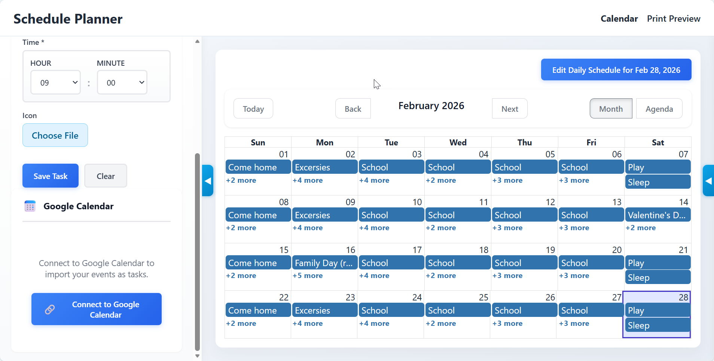
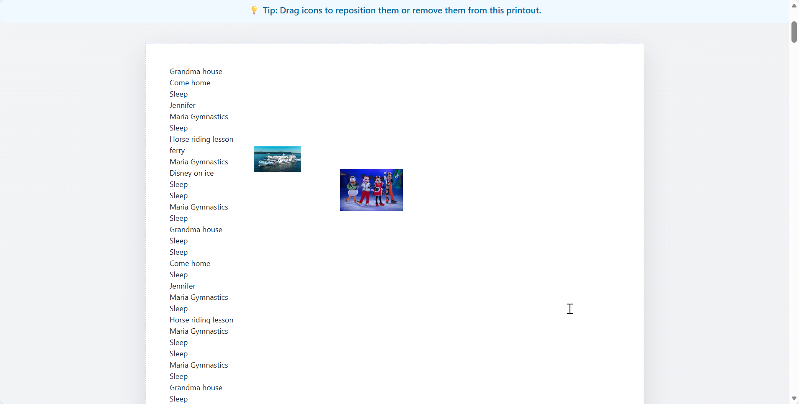

# Schedule Manager

## History

This project was born out of a personal need to support my daughter, who lives with an intellectual disability. For her, understanding the abstract concept of time passage is challenging. We discovered that a visual, linear representation of her day - a large list of events paired with images that she can physically cross out as they are completed - provides her with a clear and tangible sense of progress and structure.

## Main Idea

The main purpose of this application is to generate a visual schedule that helps users track daily events. It allows creating a printable list of events with associated images, making it easier to visualize the flow of the day and "cross out" completed activities.



## Install

Download `ScheduleManager-Setup.exe` from the
[latest release](https://github.com/bohdan-natsevych/schedule/releases/latest)
and run it. It installs for the current user only, into
`%LOCALAPPDATA%\Programs\ScheduleManager`, and needs no administrator rights.

Your schedule, uploaded images and Google sign-in live in
`%LOCALAPPDATA%\Schedule Manager` and are never touched by an install, an
update or an uninstall.

### Updating

Every push to `master` publishes a new release, so the installer only has to be
downloaded by hand once. After that, use **Check for updates** in the top-right
corner of the application: it downloads the newest installer, installs it
silently, and restarts the application.

### Releasing

`.github/workflows/release.yml` runs on every push to `master`. It reads the
latest release tag, bumps the patch number, stamps that version into
`backend/app/version.py` with `tools/stamp_version.py`, builds the frontend,
freezes the app with PyInstaller, compiles `installer.iss` with Inno Setup and
publishes `ScheduleManager-Setup.exe` as a GitHub release.

The latest release tag is the only source of truth for the version. Nothing is
committed back to the repository, and the `APP_VERSION` in `backend/app/version.py`
is only what a source checkout reports.

## Quick Start

### Prerequisites

- Python 3.11 or higher
- Node.js and npm (for building the frontend)

### Development

The easiest way to run the application in development mode is using the provided script:

1. Clone the repository
2. Run the development script:
   ```batch
   dev.bat
   ```

This script will automatically:
- Create a Python virtual environment
- Install backend dependencies
- Install frontend dependencies
- Start both backend and frontend servers in development mode

### Manual Installation

If you prefer to set up the environment manually:

1. **Backend Setup**:
   ```bash
   # Create virtual environment
   python -m venv venv
   
   # Activate virtual environment
   # Windows:
   .\venv\Scripts\activate
   # Linux/Mac:
   source venv/bin/activate
   
   # Install dependencies
   cd backend
   pip install -r requirements.txt
   ```

2. **Frontend Setup**:
   ```bash
   cd frontend/client
   npm install
   npm run build
   ```

3. **Running the Application**:
   ```bash
   # From the root directory (with venv activated)
   python launcher.py
   ```

## Tools & Scripts

The project includes several utility scripts to help with development, building, and maintenance:

- **`dev.bat` / `dev.ps1`**: 
  Development starter script. Automatically sets up the Python virtual environment, installs backend and frontend dependencies, and launches both servers in development mode with hot-reloading.
- **`build.bat`**: 
  Build automation script for Windows. It installs dependencies, builds the frontend assets, compiles the application into a standalone executable using PyInstaller, and (optionally) generates an installer using Inno Setup.
- **`launcher.py`**: 
  The main application entry point. It handles environment setup (database paths, asset locations) and launches the backend server while serving the frontend. It works both when running from source and as a compiled executable.

## Google Calendar Integration (Optional)

The application supports importing events from Google Calendar. This feature requires you to set up your own Google Cloud credentials:

1. Copy `google_credentials.example.json` to `google_credentials.json`
2. Follow the [Google Calendar Setup Guide](docs/GOOGLE_CALENDAR_SETUP.md) to create your own OAuth credentials
3. Replace the placeholder values in `google_credentials.json` with your actual credentials

In an installed copy the file belongs in `%LOCALAPPDATA%\Schedule Manager\`,
next to the database, so that updates leave it and the saved sign-in alone. A
`google_credentials.json` found in the program directory on startup is copied
there once, which is what happens to installs made before that folder was used.

## Documentation

- [User Guide](docs/USER_GUIDE.md) - How to use the application.
- [Build Instructions](docs/BUILD.md) - How to build the application from source.
- [Google Calendar Setup](docs/GOOGLE_CALENDAR_SETUP.md) - Configuring Google Calendar integration.

## License

MIT License

Copyright (c) 2024

Permission is hereby granted, free of charge, to any person obtaining a copy
of this software and associated documentation files (the "Software"), to deal
in the Software without restriction, including without limitation the rights
to use, copy, modify, merge, publish, distribute, sublicense, and/or sell
copies of the Software, and to permit persons to whom the Software is
furnished to do so, subject to the following conditions:

The above copyright notice and this permission notice shall be included in all
copies or substantial portions of the Software.

THE SOFTWARE IS PROVIDED "AS IS", WITHOUT WARRANTY OF ANY KIND, EXPRESS OR
IMPLIED, INCLUDING BUT NOT LIMITED TO THE WARRANTIES OF MERCHANTABILITY,
FITNESS FOR A PARTICULAR PURPOSE AND NONINFRINGEMENT. IN NO EVENT SHALL THE
AUTHORS OR COPYRIGHT HOLDERS BE LIABLE FOR ANY CLAIM, DAMAGES OR OTHER
LIABILITY, WHETHER IN AN ACTION OF CONTRACT, TORT OR OTHERWISE, ARISING FROM,
OUT OF OR IN CONNECTION WITH THE SOFTWARE OR THE USE OR OTHER DEALINGS IN THE
SOFTWARE.

## Note

This project was vibe-coded.

